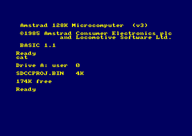
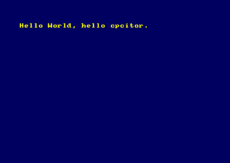

Tutorial: using cpc-dev-tool-chain with a custom project
==============================================

## Preamble

Let's name your CDTC installation location once and for all.
Adjust the line below to fit your installation.

	export MY_CDTC_ROOT=/my-path/cpc-dev-tool-chain

## Choose a location, create directory

The location below is just an example

	mkdir -p ~/my_cdtc_project
	cd ~/my_cdtc_project

## Declare it's a cdtc project

One line:

	${MY_CDTC_ROOT}/new-sdcc-project.sh .

It outputs:

    Current dir is : /home/joe/my_cdtc_project
    Proceeding with : .

## Create a C source

Open an editor or just copy-paste this line:

	{ echo "#include <stdio.h>" ; echo 'int main() { printf("Hello World.\n"); while (1) {} ; return 0; }' ; } >hello.c

Let's check the result.

	cat hello.c

It should look like:

    #include <stdio.h>
    int main() { printf("Hello World.\n"); while (1) {} ; return 0; }

## Compile

Again, one line:

	make dsk

Many lines scroll, especially the first time to fetch+compile some tools.
It ends with this :

    ************************************************************************
    ************************************************************************
    **************** Current directory is: /home/joe/my_cdtc_project
    **************** Image ready: in sdccproj.dsk
    ************************************************************************
    **************** Fire up your favorite emulator and run from it: sdccproj.bin
    ************************************************************************
    ************************************************************************

## Run

Open dsk in an emulator (or transfer to real CPC as you wish).

Run program:

	run"sdccproj

See result:

