* [Next: install instructions -> After system preparation](../how_to_install.md#after-system-preparation)
* [Back to main documentation](../../README.md)

### How to quickly get all prerequisites on Cygwin

Download setup-x86.exe from cygwin.com and store in any location (Windows suggests your desktop folder).

(Optional: store it or move it after download to some folder of your choice, e.g. a new empty folder. The installer will keep a cache of downloaded files, by default next to the installer. This might help if for any reason you'd like to start over without downloading again.)

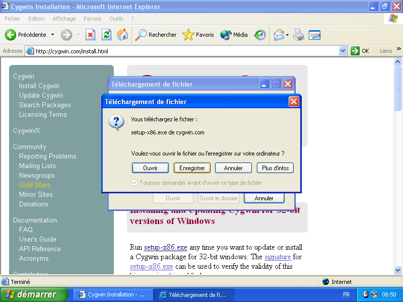

Run installer.

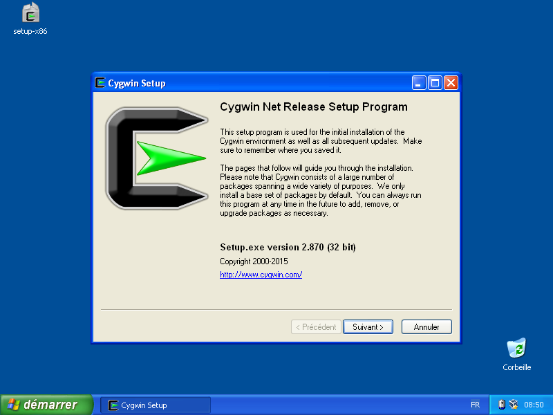

Installer will ask to select root install directory. Default is fine.

`cpc-dev-tool-chain` doesn't need administrator permissions, so if you're running from a non-privileged account, cygwin will automatically select the "Just Me" option.

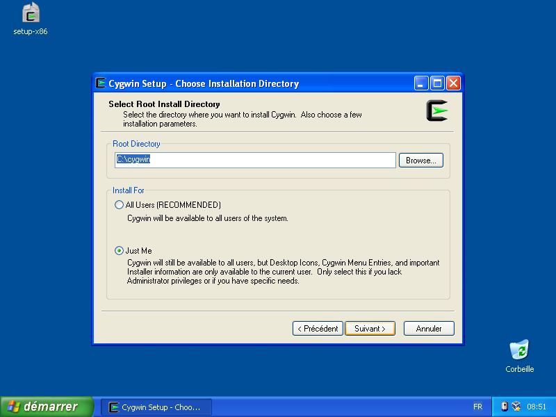

Optional at step below: select any package you may need for your own use of Cygwin. Else just press "Next".

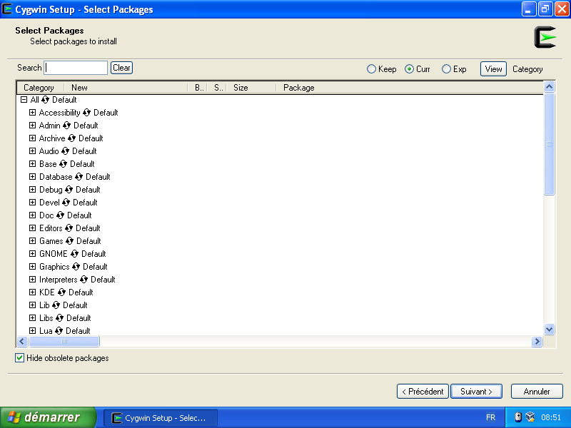

Now a base cygwin system is installed.  We'll run a command line to install packages needed by `cpc-dev-tool-chain`.
In start menu choose "Run..."

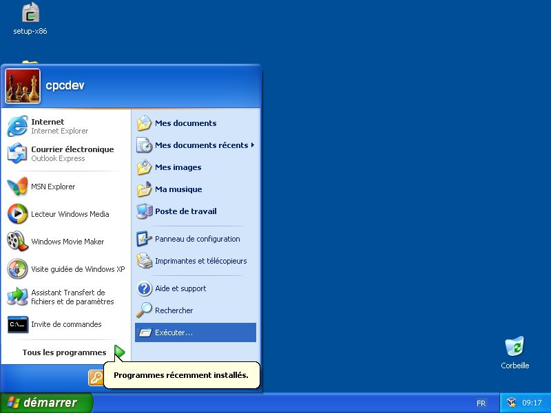

Type "cmd".

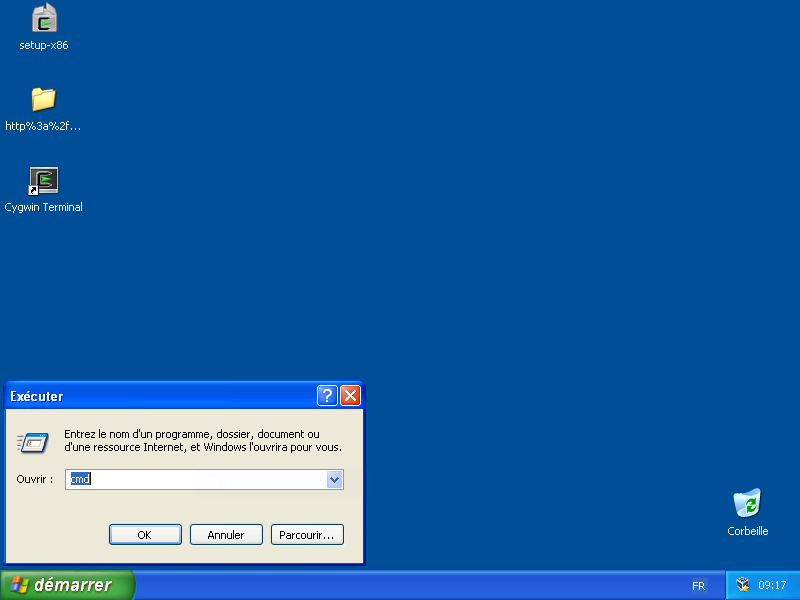

Drag-n-drop the `setup-x86` icon onto the window.  This will automatically type the correct path.

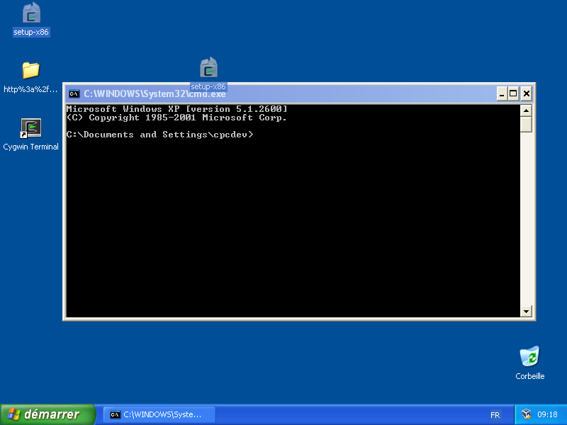

After drag-n-drop you'll see the path:

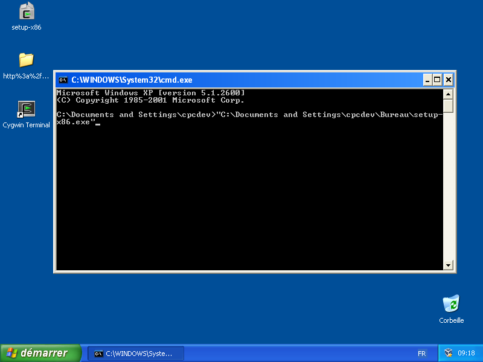

Now select the text below and use right click, key shortcut, whatever, to copy it to your clipboard.

<pre>
#Don't select the current line for copying, only the line below starting with -q...
     -q -P git,make,patch,gcc,gcc-core,gcc-g++,wget,bison,flex,libboost-devel,unrar,libncurses-devel,ioperm

</pre>

Right click in terminal then select "paste".

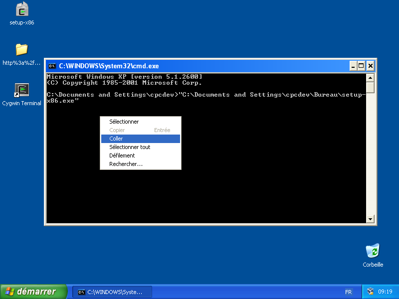

The result will be a complete command line, like below.

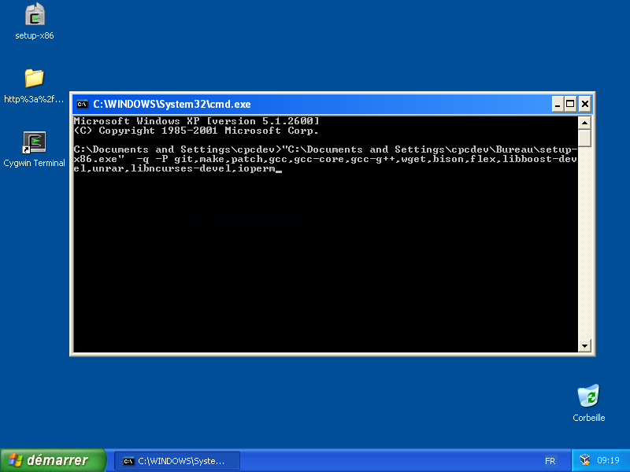

Press Enter.  The needed packages will automatically download and install.

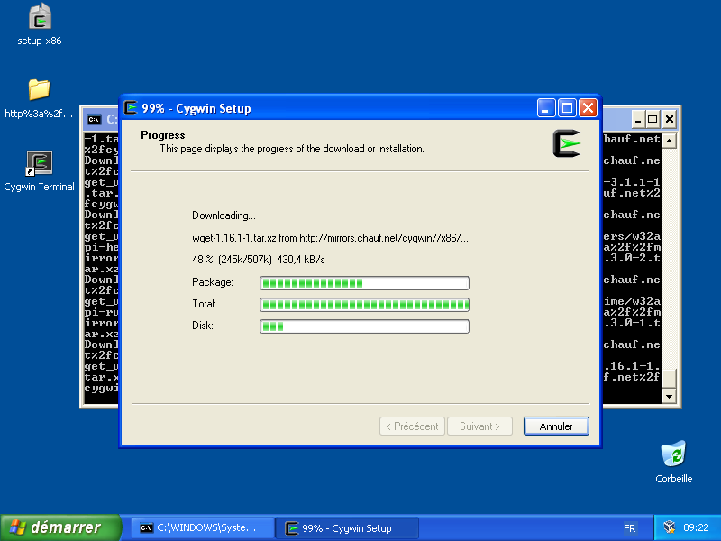

Congratulations, your Windows is ready to host `cpc-dev-tool-chain`.

### Next

* [Next: install instructions -> After system preparation](../how_to_install.md#after-system-preparation)
* [Back to main documentation](../../README.md)
